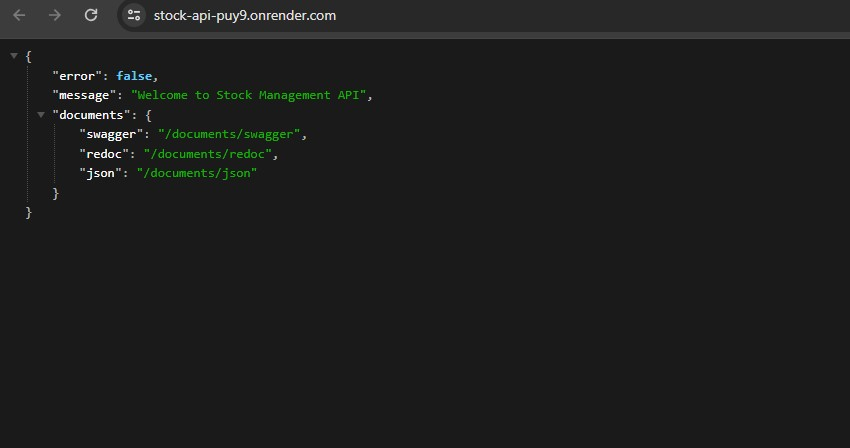

# stockapi-fs-backend

Stock app is a product managament system that you can make crud process. And this repo is the backend side of the project. To see the backend repo you can visit [stockapi-fs-frontend repo.](https://github.com/Hasan-Turkel/stockapi-fs-frontend)  

## [Click to see live link](https://stock-api-puy9.onrender.com/)

## This is how the site looks like.

